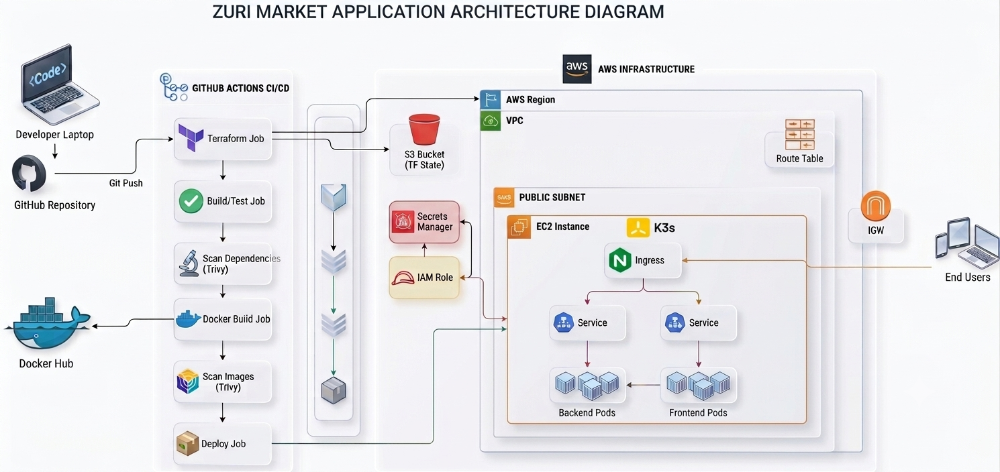

# Zuri Market e-commerce Platform Deployment to Kubernetes (K3s)

## 1. Project Overview

This project demonstrates DevSecOps deployment pipeline for a containerized full-stack application running on Kubernetes (K3s) hosted on AWS EC2.

The project demonstrates modern DevOps and DevSecOps practices including:

- AWS Infrastructure provisioning with Terraform
- Remote Terraform State Management with state locking (S3 Bucket)
- Containerization with Docker
- GitHub Actions for Continuous Integration and Continuous Deployment (CI/CD)
- Application Dependencies and Container Vulnerability Scanning using Trivy
- Secret Management with AWS Secrets Manager
- IAM Roles with least privilege for Secure Access
- AWS SDK for runtime secrets retrieval
- Application Deployment to Kubernetes Cluster using Deployments and Services and Ingress objects


## 2. Pre-requisites


- Docker and Docker Desktop
- Node.js installed
- AWS CLI installed
- Terraform installed
- AWS SDK Client manager installed in backend folder


## 2. Architecture Diagram




## 3. Tech Stack

 Frontend: React/Vite, Nginx

 Backend: Node.js/Express.js, AWS SDK 

 DevOps: Docker, Docker Hub, K3s (Kubernetes), Terraform, AWS Secrets Manager, AWS EC2, AWS VPC, AWS IAM,  Amazon S3 (with S3 Lockfile), GitHub Actions, Trivy.


## 4. Frontend and Backend Documentations

[Frontend Documentation](./documentation/frontend-documentation.md)

[Backend Documentation](./documentation/backend-documentation.md)


## 5. Project Structure

```tree
project-root/
│
├── .github/
│   └── workflows/
│       └── (GitHub Actions CI/CD pipelines)
│
├── documentation/
│   └── (Project documentation files)
│
├── kubernetes-manifests/
│   ├── backend-deployment.yaml
│   ├── backend-service.yaml
│   ├── frontend-deployment.yaml
│   ├── frontend-service.yaml
│   └── ingress.yaml
│
|
|    
├── terraform/
│   ├── modules/
│   │   ├── ec2-instance/
|   |   ├── network/
|   |   └── securitygroup/
│   │
│   ├── .gitignore
│   ├── backend.tf
│   ├── main.tf
│   ├── outputs.tf
│   ├── providers.tf
│   └── variables.tf
│
├── zuriapp-backend-main/
│   └── (Node.js/Express backend source code)
│
├── zuriapp-frontend-main/
│   └── (React/Vite frontend source code)
│
├── .gitignore
├── README.md
└── docker-compose.yml
```


| Path/File                                       | Purpose                       | What It Does                                                                                                                               |
| ----------------------------------------------- | ----------------------------- | ------------------------------------------------------------------------------------------------------------------------------------------ |
| `.github/workflows/`                            | CI/CD Pipelines               | Contains GitHub Actions workflows that automate terraform provisioning, testing, building, Docker image creation and Kubernetes deployment. (deploy.yaml and destroy.yaml) |
| `kubernetes-manifests/`                         | Kubernetes Resources          | Contains all Kubernetes YAML files required to deploy and expose the application on a K3s cluster.                                         |
| `kubernetes-manifests/backend-deployment.yaml`  | Backend Deployment            | Creates and manages backend application Pods.                                                                       |
| `kubernetes-manifests/backend-service.yaml`     | Backend Service               | Exposes backend Pods within the internal Kubernetes cluster.                                                                        |
| `kubernetes-manifests/frontend-deployment.yaml` | Frontend Deployment           | Creates and manages frontend application Pods.                                                                                 |
| `kubernetes-manifests/frontend-service.yaml`    | Frontend Service              | Exposes frontend Pods within the Kubernetes cluster.                                                                                       |
| `kubernetes-manifests/ingress.yaml`             | External Access               | Routes external traffic from users to the appropriate frontend or backend service.                                                         |
| `terraform/`                                    | Infrastructure as Code        | Contains Terraform configurations used to provision cloud infrastructure.                                                    |
| `terraform/modules/`                            | Reusable Terraform Components | Stores reusable infrastructure modules such as networking, compute and security groups resources. 
| `modules/network/`       | Networking Infrastructure | Defines the network resources required by the application, such as VPC, subnet, route table, internet gateway|
| `modules/securitygroup/` | Security Configuration    | Defines the rules that control inbound and outbound traffic to infrastructure resources.                                 |
| `modules/ec2-instance/`  | Compute Resources         | Defines EC2 instances and IAM role used to host the K3s cluster and application workloads.                                          |                                                |
| `terraform/.gitignore`                          | Terraform Ignore Rules        | Prevents Terraform state files, sensitive data from being committed to Git.                                               |
| `terraform/providers.tf`                        | Provider Configuration        | Defines cloud providers (e.g., AWS) and Terraform version requirements.                                                                    |
| `backend.tf`                                    | Remote Terraform State Management | Terraform uses an S3 bucket to store the remote state, enabling multiple users and GitHub Actions to share the same infrastructure state.                                                             |
| `terraform/variables.tf`                        | Input Variables               | Declares configurable variables used throughout the Terraform configuration.                                                               |
| `terraform/main.tf`                             | Infrastructure Definition     | Calls and configures Terraform modules that provision infrastructure resources.                                                          |
| `terraform/outputs.tf`                          | Output Values                 | Displays useful information after deployment, such as server IP, VPC IP.                                                    |
| `zuriapp-backend-main/`                         | Backend Application           | Contains the Node.js/Express API source code, routes, controllers, and business logic.                                                     |
| `zuriapp-frontend-main/`                        | Frontend Application          | Contains the React/Vite source code responsible for the user interface.                                                                    |
| `.gitignore`                                    | Git Ignore Rules              | Specifies files and directories that Git should not track, such as `node_modules` and secrets.                                             |
| `README.md`                                     | Project Overview              | Provides information about the project, setup instructions, architecture, and deployment steps.                                            |
| `docker-compose.yml`                            | Local Development Environment | Runs frontend and backend containers together for local testing and development.                                                           |