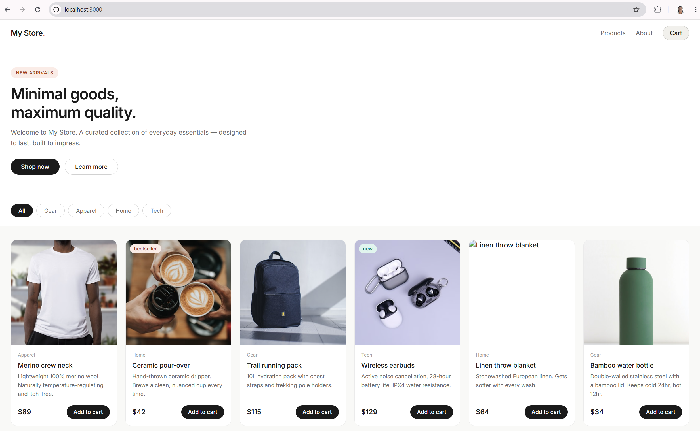

# Running the App with Docker (Local Setup)

This guide explains how to run both the frontend and backend using Docker on your local machine.

---

## 1. Prerequisites

Make sure you have the following installed:

- Docker Desktop started


Check Docker installation:

```bash
docker --version
```

---

## 2. Project structure

Ensure your folder looks like this:

```
root-folder/
  zuriapp-backend-main/
  frontend-frontend-main/
  docker-compose.yml
```

---

## 3. Create docker-compose.yml

In the root folder, create a file named `docker-compose.yml`:

```yaml
services:
  backend-app:
    container_name: backend-app
    restart: unless-stopped
    build: ./zuriapp-backend-main
    ports:
      - "5000:5000"
    env_file:
      - ./zuriapp-backend-main/.env

  frontend-app:
    container_name: frontend-app
    restart: unless-stopped
    build: ./zuriapp-frontend-main
    ports:
      - "3000:3000"
    env_file:
      - ./zuriapp-frontend-main/.env
```

---

## 4. Create Backend Dockerfile

Inside the backend folder, create a file named `Dockerfile`:

```dockerfile
FROM node:26-alpine3.22

WORKDIR /app

COPY package*.json ./

RUN npm install 

COPY . .

EXPOSE 5000

CMD ["npm", "start"]
```

Create a file named `.dockerignore` and add the following to prevent them from being added to the docker image:

```
node_modules
npm-debug.log
.env
```
---

## 5. Create Frontend Dockerfile

Inside the frontend folder, create a file named `Dockerfile`:

```dockerfile
FROM node:26-alpine3.22

WORKDIR /app

COPY package*.json ./

RUN npm install

COPY . .

EXPOSE 3000

CMD ["npm", "run", "dev", "--", "--host"]
```

Create a file named `.dockerignore` and add the following to prevent them from being added to the docker image:

```
node_modules
npm-debug.log
.env
```

---

## 7. Start the app with Docker

From the root folder, run the containers in detached:

```bash
docker-compose up -d --build
```
Verify that the containers are running: 

```bash
docker ps
```

---

## 8. Access the app


Access the app at `localhost:3000` on your browser


You now have your full app running in Docker locally.




---

## 9. Stop the app

```bash
docker-compose down
```

