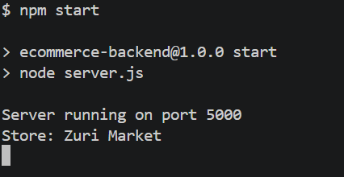
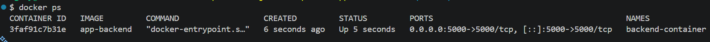

# Zuri Market e-commerce Platform Deployment to Kubernetes (K3s)

## 1. Backend Overview

The Backend is the REST API powering the Zuri Market ecommerce platform. It serves product data, handles cart validation and exposes store configuration. 

## 2. Tech Stack

 Node.js, Express.js, AWS SDK 


## 3. Backend folder Structure

```tree
zuriapp-backend-main/      
├── Dockerfile
├── server.js
├── secrets.js
├── .env.example
├── package.json
├── package-lock.json
├── .env
├── .dockerignore
├── .gitignore
├── data/
│   └── products.js
└── node_modules/
```

### Descriptions

| File / Folder |	Purpose |
|--------|------------|
| `Dockerfile`	| Defines how the backend Docker image is built and started. |
| `server.js`	| Main entry point of the Express application. |Contains API routes and server configuration.
| `secrets.js` |	Retrieves secrets from AWS Secrets Manager using the AWS SDK. |
| `.env.example` |	Template showing required environment variables for local development. |
| `.env`	| Local environment variables used during development. Not committed to GitHub. |
| `package.json`	| Node.js project manifest containing dependencies and scripts. | 
| `package-lock.json`	| Locks dependency versions to ensure consistent builds. |
| `.dockerignore`	| Excludes unnecessary files from Docker image builds. |
| `.gitignore`	| Prevents sensitive and generated files from being committed to Git. |
| `data/products.js`	| Contains mock product data used by the API.
| `node_modules/`	| Installed npm packages generated by npm install. |

## 4. Environment variables

| Variable | Description | Default |
|--------|------------|--------|
| PORT | Server port | 5000 |
| STORE_NAME | Store name | My Store |
| API_SECRET_KEY | API key for protected routes | — |


## 5. Running locally

```bash
cd zuriapp-backend-main
```
and run:
```
npm install
```

Create a file named `.env` inside `zuriapp-backend-main` folder and edit the variables:

```env
API_SECRET_KEY=your-secret-key
STORE_NAME=your-store-name
```

Run:

```bash
npm start
```

If that fails, run:

```bash
npm run
```

Backend will run on:

```
http://localhost:5000
```
as seen in the image below 




To run both frontend and backend locally, please refer this documentation [here](/documentation/run-app-locally.md).

## 6. API endpoints

Please refer to the documentation [here](/documentation/api-endpoints.md) for this section.

## 7. Docker

Inside the backend folder, create a file named `Dockerfile`:

```dockerfile
FROM node:24-alpine

WORKDIR /app

COPY package*.json ./

RUN npm install 

COPY . .

EXPOSE 5000

CMD ["npm", "start"]
```
Create a file named `.dockerignore` and add the following to prevent them from being added to the docker image:

```
node_modules
npm-debug.log
.env
```
---

The backend application is containerized using Docker. To build the image locally, navigate to the backend project directory and run:

```bash
docker build -t app-backend .
```

Run the Backend Container Locally

```bash
docker run -d \
  --name backend-container \
  -p 5000:5000 \
  -e API_SECRET_KEY=my-local-key \
  -e STORE_NAME="Zuri Market" \
  app-backend
```

In Kubernetes, these values are retrieved from AWS Secrets Manager using the AWS SDK.

Verify:

```bash
docker ps
docker logs backend-container
curl http://localhost:5000/api/store
```

Stop and remove:

```bash
docker stop backend-container
docker rm backend-container
```
## DockerHub Image Naming Convention

The CI/CD pipeline publishes:

```text
munirihzowe/zuriapp-backend:latest
munirihzowe/zuriapp-backend:<github-sha>
```

This always points to the most recent successful build.
  

To test the full frontend and backend application locally, please refer to the documentation [here](/documentation/docker-local-setup.md).

## 8. Deployment

GitHub Actions is triggered when the source code is pushed to the main branch and runs the pipeline. The infrastructure is provisioned automatically using Terraform from GitHub Actions which also handles application build, security scanning with Trivy, image publishing, and deployment to a K3s cluster running on AWS EC2. Please refer to `deploy.yml` inside `.github/workflow/` to view the full deployment pipeline.


The backend application uses the AWS SDK to securely fetch sensitive data from AWS Secrets Manager at runtime. This eliminates the need to store secrets in source code, Docker images, Kubernetes manifests, or GitHub repositories. AWS SDK client manager is installed in the backend folder, a module called `secrets.js` is created to fetch the secrets and `server.js` is refactored to load secrets before starting the server. 

## 9. Secrets

 Please refer to the documentation [here](/documentation/secret-management.md) for this section.

