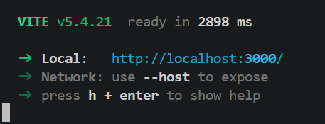
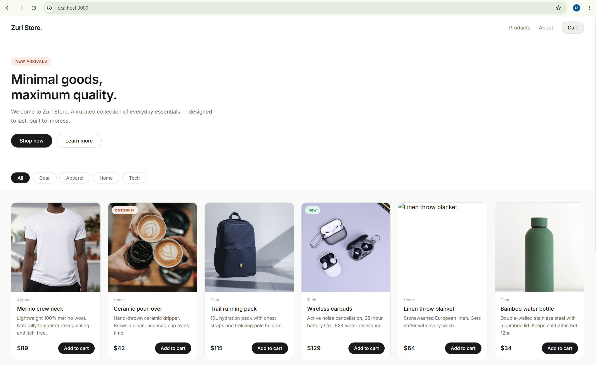

# Node.js Application (Frontend + Backend)

This project consists of an applications with:

- Frontend (React)
- Backend (Node.js / Express API)

Ensure your folder looks like this:

```
root-folder/
  zuriapp-backend-main/
  frontend-frontend-main/
```

Follow the steps below to run the app locally.


---

## 1. Prerequisites

Make sure you have the following installed:

- Node.js (v16 or higher)
- npm (comes with Node.js)
- Git

---

## 2. Clone the repository to your local machine

```bash
git clone <app-repo-url>
```

---

## 3. Install dependencies

### Backend

```bash
cd zuriapp-backend-main
npm install
```

### Frontend

```bash
cd zuriapp-frontend-main
npm install
```

---

## 4. Configure environment variables

### Backend

Create a file named `.env` inside `zuriapp-backend-main` folder and edit the variables:

```env
API_SECRET_KEY=your-secret-key
STORE_NAME=your-store-name
```

### Frontend

Create a file named `.env` inside `zuriapp-frontend-main` folder and edit the variables:

```env
VITE_API_URL=http://localhost:5000
VITE_STORE_NAME=your-store-name
```

---

## 5. Run the backend

In the backend folder:

```bash
npm start
```

If that fails, run:

```bash
npm run
```

Backend will run on:

```
http://localhost:5000
```
as seen in the image below 


---

## 6. Run the frontend

Open a new terminal:

```bash
npm run dev
```

Frontend will run on 

```
http://localhost:3000
```
as seen in the image below:


---

## 7. Open the app

Open your browser and go to:

```
http://localhost:3000
```
---

You now have the app running locally.




